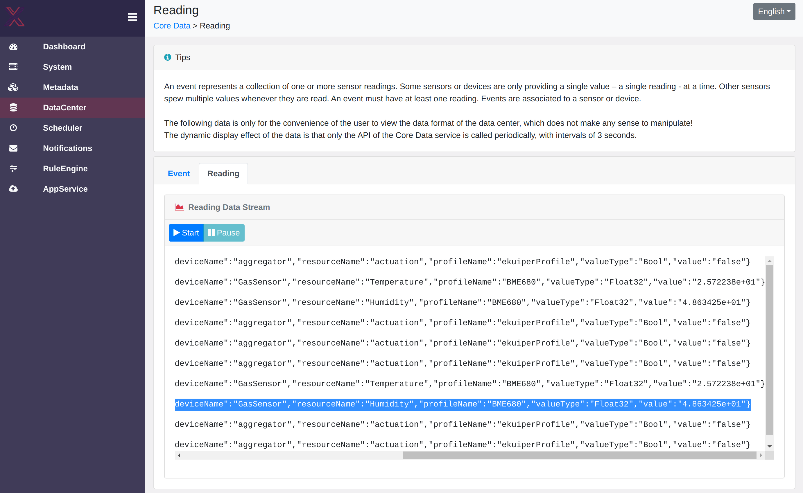
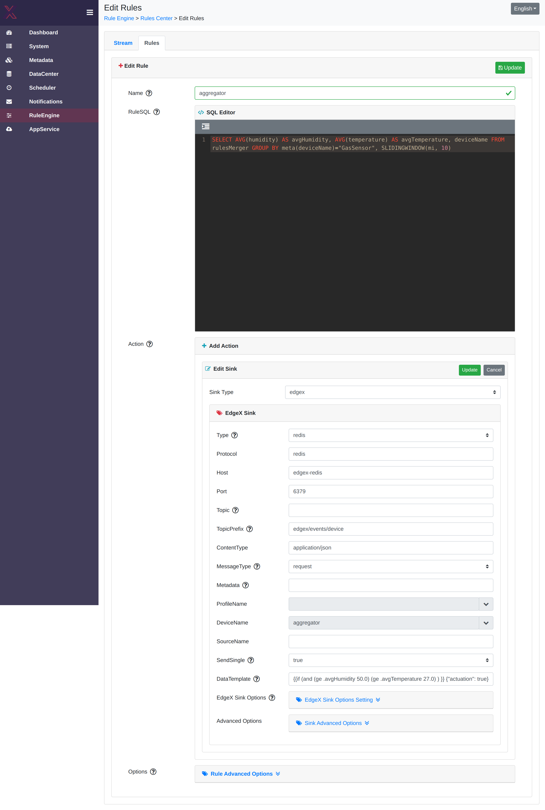
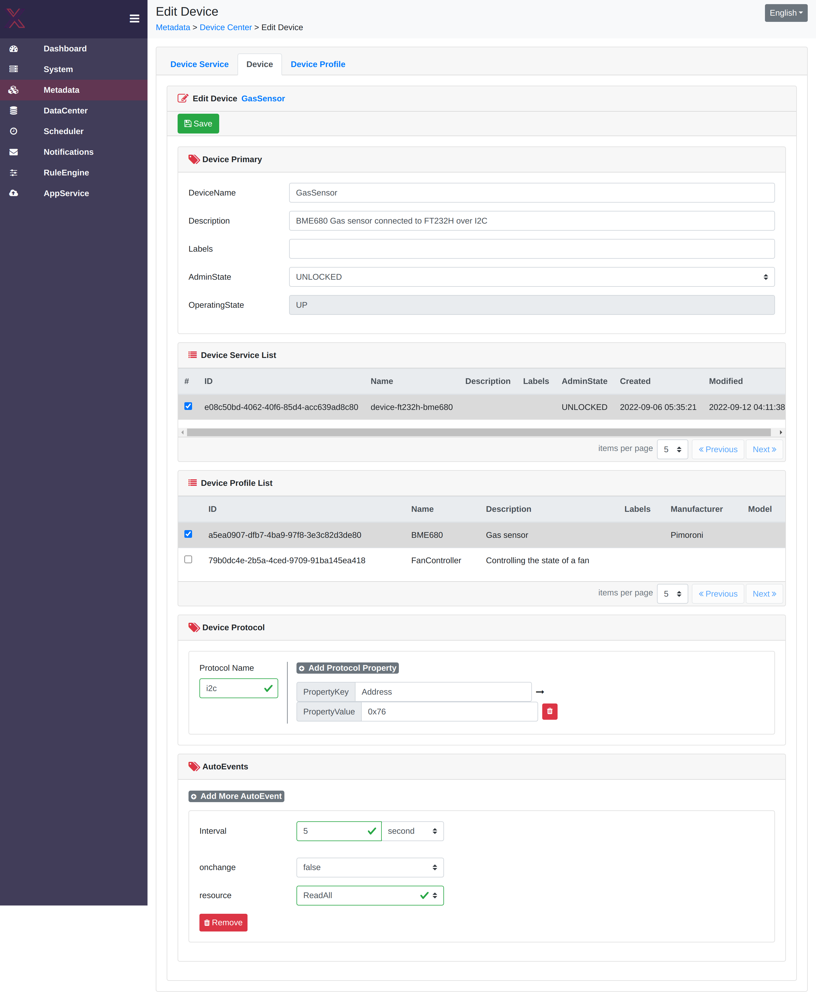

# Climate Control Demo

This is a guide to setup a simple climate control demo with EdgeX and your personal computer.

## Hardware / Software requirements

```mermaid
graph TD
    Computer --USB--> FT232H[Breakout Board] --> Computer
    FT232H --I2C--> BME680[Gas Sensor] --> FT232H
    FT232H --GPIO--> Fan
```

- AMD64 computer with a USB port - This is where we will run EdgeX
  - Running Ubuntu 22.04
- [Adafruit FT232H](https://www.adafruit.com/product/2264) USB to GPIO, SPI, I2C breakout board
- [BME680](https://learn.pimoroni.com/article/getting-started-with-bme680-breakout) gas sensor
- 3.3v fan or LED for actuation

## Set up the hardware
FT232H pinout: https://learn.adafruit.com/circuitpython-on-any-computer-with-ft232h/pinouts

FT232H setup: https://learn.adafruit.com/circuitpython-on-any-computer-with-ft232h/linux

GPIO: https://learn.adafruit.com/circuitpython-on-any-computer-with-ft232h/gpio

BME680 sensor: https://learn.pimoroni.com/article/getting-started-with-bme680-breakout

BME680 library: https://github.com/adafruit/Adafruit_CircuitPython_BME680

## Run test scripts
Example:
```bash
source env.sh
python test-ft232h-gpio.py
```

## Install EdgeX platform
```
sudo snap install edgexfoundry
```

## Install the device service
Refer to [edgex-device-ft232h-bme680](https://github.com/farshidtz/edgex-device-ft232h-bme680)
## Install and configure rules engine (aka eKuiper)
```
sudo snap install edgex-ekuiper
```
Update configuration file in eKuiper to subscribe to all EdgeX events in EdgeX Message bus:
```
sudo nano /var/snap/edgex-ekuiper/current/etc/sources/edgex.yaml
# change value of `default.topic` from `rules-events` to `edgex/events/#`
# change value of `default.messageType` from `event` to `request`
```


Restart the service to pick up the changes made to the config file:
```
sudo snap restart edgex-ekuiper
```

Please refer to [edgex-ekuiper-snap](https://github.com/canonical/edgex-ekuiper-snap#work-without-app-service-configurable-filtering) for detailed instructions.

## Setup streams and rules pipeline
```mermaid
graph TD
    A[BME680 gas sensor] --> I.1[edgex message bus] --> B[edgexStream]
    B --> C[humidityFilter]
    B --> D[temperatureFilter]
    C --> E[memory sink]
    
    D --> E
    E --> F[rulesMerger]
    F --> G[aggregator]
    
    G --> I.2[edgex message bus]
    I.2 --> K[aggregatorStream]
    K --> L[actuation] 
    L --> I.3[edgex message bus]
    
style B stroke:#333,stroke-width:4px
style C stroke:#333,stroke-width:4px
style D stroke:#333,stroke-width:4px
style E stroke:#333,stroke-width:2px,stroke-dasharray: 5, 5
style F stroke:#333,stroke-width:4px
style G stroke:#333,stroke-width:4px
style K stroke:#333,stroke-width:4px

style I.1 fill:#f9f,stroke:#333,stroke-width:4px
style I.2 fill:#f9f,stroke:#333,stroke-width:4px
style I.3 fill:#f9f,stroke:#333,stroke-width:4px
```

1. Create stream `edgexStream`:
```
edgex-ekuiper.kuiper create stream edgexStream '() WITH (TYPE="edgex")'
```

This is our input entry point. This stream collects the data from EdgeX Message Bus and adds it to an eKuiper in-memory stream for further processing by other rules.

2. Create rule `humidityFilter`:
```
edgex-ekuiper.kuiper create rule humidityFilter '
{
 "sql":"SELECT humidity, deviceName FROM edgexStream WHERE humidity >= 0 AND humidity <= 100",
 "actions": [
     {
       "log":{}
     },
    {
      "memory": {
       "topic": "result/source/humidityFilter"
      }
    }
  ]
}'
```

This rule is to filter sensible humidity events to avoid out of range values falsely reported from the sensor.

We send the result of the `humidityFilter` to the memory sink where we can reuse 
the result in multiple successive rules running in parallel.

3. Create rule `temperatureFilter`:
```
edgex-ekuiper.kuiper create rule temperatureFilter '
{
 "sql":"SELECT temperature, deviceName FROM edgexStream WHERE temperature >= -40 AND temperature <= 85",
 "actions": [
     {
       "log":{}
     },
    {
      "memory": {
       "topic": "result/source/temperatureFilter"
      }
    }
  ]
}'
```

This rule is to filter out temperature events that are out of range for our sensor.

The `temperatureFilter` rule here could be extended into two rules for further analysis.
As an example, the first rule could filter out extreme or unrealistic data, 
and the second rule could convert the temperature from Celsius to Fahrenheit.

4. Create stream `rulesMerger`:
```
edgex-ekuiper.kuiper create stream rulesMerger '() WITH (DATASOURCE="result/source/#",TYPE="memory")'
```

This is necessary to multiplex events from all our sources into one in preparation for the next rule.

5. Create rule `aggregator`:
```
edgex-ekuiper.kuiper create rule aggregator '
{
  "sql":"SELECT AVG(humidity) AS avgHumidity, AVG(temperature) AS avgTemperature, deviceName FROM rulesMerger GROUP BY meta(deviceName)=\"GasSensor\", HOPPINGWINDOW(ss, 30, 10)",
  "actions": [
    {
      "log":{}
    },  
    {
      "edgex": {
        "connectionSelector": "edgex.redisMsgBus",
        "topicPrefix": "edgex/events/device",
        "messageType": "request",
        "sendSingle": true,
        "deviceName": "aggregator",
        "contentType": "application/json",
        "dataTemplate": "{{if (and (ge .avgHumidity 50.0) (ge .avgTemperature 30.0) ) }} {\"actuation\": true} {{else}} {\"actuation\": false} {{end}}"
      }
    }
  ]
}'
```

This rule has two important parts:
- The sql which is to aggregate data using a [window function](https://ekuiper.org/docs/en/latest/sqls/windows.html) to have stable measurements. 
- The action that defines what values should trigger an actuation event.

The sql can be modified to have another window function. For example, using `SLIDINGWINDOW(mi, 10)` instead could provide more frequent output because unlike the hopping window, a sliding window produces a new output after every event.

We could add a memory sink in the actions - as done in steps 2 and 3.
Then, further rules can consume data from the memory sink and perform more analysis.

The current `edgex` action sends the output to the EdgeX Message Bus.
The reason we submit the results to message bus instead of memory is because we need to use the `dataTemplate` feature that is currently not supported for memory actions.
This template is an important part of the rule because it is responsible for deciding when we want to actuate.

6. Create stream `aggregatorStream`:
```
edgex-ekuiper.kuiper create stream aggregatorStream '() WITH (DATASOURCE="edgex/events/device/aggregator",TYPE="edgex")'
```

This is used to take the data from EdgeX Message Bus back to the memory for further processing.

7. Create rule `actuation`:
```
edgex-ekuiper.kuiper create rule actuation '
{
  "sql":"SELECT actuation FROM aggregatorStream WHERE actuation=true OR actuation=false",
  "actions": [
    {
      "log":{}
    }, 
    {
      "rest": {
        "url": "http://localhost:59882/api/v2/device/name/Fan/State",
        "method": "PUT",
        "bodyType": "json",
        "dataTemplate":  "{\"State\":{{.actuation}}}",
        "sendSingle": true
      }
    }
  ]
}'
```

Finally, this is where the actuation request takes place. This rule forwards the requests to the REST API of our device service.

If needed, we can forward this data to the EdgeX Message Bus by adding the following action:
```
    {
      "edgex": {
        "connectionSelector": "edgex.redisMsgBus",
        "topicPrefix": "edgex/events/device",
        "messageType": "request",
        "sendSingle": true,
        "deviceName": "actuation",
        "contentType": "application/json",
        "dataTemplate": "{\"State\":{{.actuation}}}"
      }
    }
```

We could also submit the request to EdgeX's [Support Notification](https://docs.edgexfoundry.org/2.2/microservices/support/notifications/Ch-AlertsNotifications/) service to send emails or other notifications.

Viewing and following logs:
```
snap logs -f edgex-ekuiper
```

## Query results

### [EdgeX CLI](https://snapcraft.io/edgex-cli)

1. [Install](https://docs.edgexfoundry.org/2.3/getting-started/Ch-GettingStartedSnapUsers/#edgex-cli)

2. Query
```
$ edgex-cli reading list --limit=10
Origin                Device      ProfileName     Value         ValueType
12 Sep 22 16:28 CEST  aggregator  ekuiperProfile  false         Bool
12 Sep 22 16:28 CEST  aggregator  ekuiperProfile  false         Bool
12 Sep 22 16:28 CEST  GasSensor   BME680          2.569758e+01  Float32
12 Sep 22 16:28 CEST  GasSensor   BME680          4.895329e+01  Float32
12 Sep 22 16:28 CEST  aggregator  ekuiperProfile  false         Bool
12 Sep 22 16:28 CEST  aggregator  ekuiperProfile  false         Bool
12 Sep 22 16:28 CEST  GasSensor   BME680          4.893637e+01  Float32
12 Sep 22 16:28 CEST  GasSensor   BME680          2.570812e+01  Float32
12 Sep 22 16:27 CEST  aggregator  ekuiperProfile  false         Bool
12 Sep 22 16:27 CEST  aggregator  ekuiperProfile  false         Bool
```

### [EdgeX UI](https://snapcraft.io/edgex-ui)
1. [Install](https://docs.edgexfoundry.org/2.3/getting-started/Ch-GettingStartedSnapUsers/#edgex-ui)
2. [Create a user](https://docs.edgexfoundry.org/2.3/getting-started/Ch-GettingStartedSnapUsers/#adding-api-gateway-users)
```
mkdir user
cd user

# Create a kay pair
openssl ecparam -genkey -name prime256v1 -noout -out private.pem
openssl ec -in private.pem -pubout -out public.pem

# Add the public key for a new user
KONG_ADMIN_JWT=`sudo cat /var/snap/edgexfoundry/current/secrets/security-proxy-setup/kong-admin-jwt`
edgexfoundry.secrets-config proxy adduser --token-type jwt --user example --algorithm ES256 --public_key public.pem --id 1000 --jwt $KONG_ADMIN_JWT

# Create a JWT token for this user
edgexfoundry.secrets-config proxy jwt --algorithm ES256 --private_key private.pem --id 1000 --expiration=1h | tee user-jwt.txt
```
Copy the output and use it to authenticate in the next step.

3. Visit [http://localhost:4000/](http://localhost:4000/)

The UI allows exploring the data in Data Center:


Try editing the data template `edgex` action of the `aggregator` rule to actuate when humidity and temperature are lower.

It also provides interfaces to view and edit the rule engine streams and rules:


Or devices and their profiles:


Editing a device:

