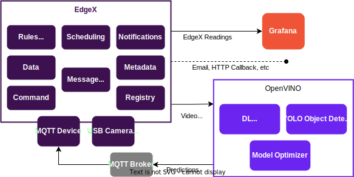
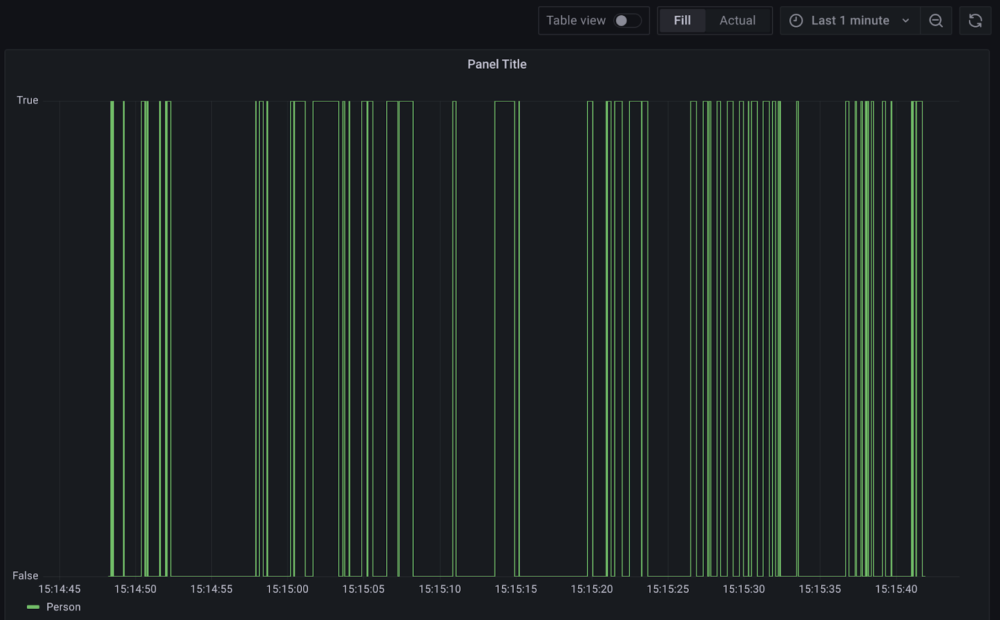
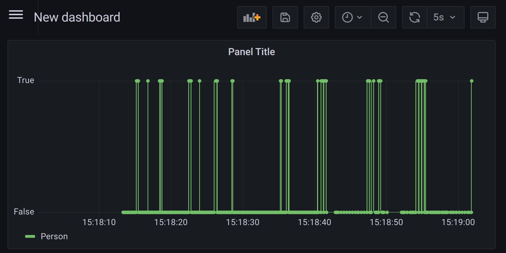

# openvino-object-detection
Object Detection with EdgeX and OpenVINO.

## Architecture



## Steps
### 1. (EdgeX) Install platform
```bash
sudo snap install edgexfoundry --channel=latest/stable
```
 
> ℹ [Extend the default secret store tokens TTL](https://docs.edgexfoundry.org/2.2/getting-started/Ch-GettingStartedSnapUsers/#secret-store-token) from 1h to 72h to avoid running into expired tokens while preparing the demo.
> Note that tokens will expire if some components are stopped for a period longer than the validity. The restart command in the given instructions can be used to issue a fresh set of tokens.

### 2. (EdgeX) Setup Device USB Camera
#### Install
```bash
sudo snap install edgex-device-usb-camera --channel=latest/edge
```

#### Connect interfaces
Connect edgex-device-usb-camera’s camera interface:
```bash
sudo snap connect edgex-device-usb-camera:camera :camera
```

#### Configure and start
```bash
sudo mv /var/snap/edgex-device-usb-camera/current/config/device-usb-camera/res/devices/general.usb.camera.toml.example \
/var/snap/edgex-device-usb-camera/current/config/device-usb-camera/res/devices/general.usb.camera.toml
```

Edit:
```bash
sudo nano /var/snap/edgex-device-usb-camera/current/config/device-usb-camera/res/devices/general.usb.camera.toml
```

- Change the path to the device if it isn't the default: `/dev/video0`.
- Do not change the name. We assume that the device name stays as default "example-camera" in the rest of this document.
> ℹ To change the device/profile after service has started, update the local files, delete from core-metadata, and restart:
> 
> ```bash
> # Delete device:
> curl -X DELETE http://localhost:59881/api/v2/device/name/example-camera
> 
> # Delete profile, if modified:
> curl -X DELETE http://localhost:59881/api/v2/deviceprofile/name/USB-Camera-General
> 
> # Restart:
> sudo snap restart edgex-device-usb-camera
> ```
> Query the above URLs to make sure the changes have been reflected.

#### Start the stream
```bash
curl -X PUT -d '{
    "StartStreaming": {
      "OutputFps": "5",
      "InputImageSize": "320x240",
      "OutputVideoQuality": "15"
    }
}' http://localhost:59882/api/v2/device/name/example-camera/StartStreaming
```
- `OutputFps`: Duplicate or drop input frames to achieve constant output frame rate fps. 
- `OutputImageSize`: Performs image rescaling. The format is `wxh`, for example, "640x480". 
- `OutputVideoQuality`: Use a fixed video quality level. The range is an integer number between 1 to 31, with 31 being the worst quality. 

Please have a look at [edgex-device-usb-camera](https://github.com/edgexfoundry/device-usb-camera#advanced-topics) for more video options.

> ℹ The usb camera could be stopped by:
> ```bash
> curl -X PUT -d '{"StopStreaming": true }' http://localhost:59882/api/v2/device/name/example-camera/StopStreaming
> ```
> Note that stopping the stream will cause openvino's container to exit! The container will automatically restart if there is a restart policy, but that may take up to a minute.
 
The Device USB Camera service 

> 🛑 Use a video player to check the video stream:
> MPlayer:
> ```bash
> mplayer rtsp://localhost:8554/stream/example-camera
> ```
> 
> VLC:
> ```bash
> vlc rtsp://localhost:8554/stream/example-camera
> ```

> ℹ To turn on device-usb-camera's auto streaming:
> ```bash
> sudo snap set edgex-device-usb-camera app-options=true
> sudo snap set edgex-device-usb-camera config.devicelist-protocols-usb-autostreaming=true
> sudo snap restart edgex-device-usb-camera.device-usb-camera
> ```

### 3. (Mosquitto) Setup MQTT Broker
Install the mosquitto broker, or any other MQTT broker. We use port 1883 for MQTT (without TLS).
```bash
sudo snap install mosquitto
```

The broker starts automatically, but just in case you have disabled it:
```bash
sudo snap start --enable mosquitto
```

### 4. (OpenVINO) Setup OpenVINO
edgex-openvino-object-detection docker image we used in this demo consists of four main components:
- [OpenVINO™ toolkit Model Downloader](https://docs.openvino.ai/latest/omz_tools_downloader.html)
- [OpenVINO™ toolkit Model Optimizer](https://docs.openvino.ai/latest/openvino_docs_MO_DG_Deep_Learning_Model_Optimizer_DevGuide.html)
- [Intel® Deep Learning Streamer](https://dlstreamer.github.io/)
- [yolo-v2-tiny-ava-0001 Object Detection Models](https://docs.openvino.ai/latest/omz_models_model_yolo_v2_tiny_ava_0001.html)

#### Build the Docker image
The current ([openvino-object-detection](.)) directory in this repo contains the Dockerfile to build a docker image.

Use the following command to build the image locally. We call it `edgex-openvino-object-detection` and use it locally in the next steps.
```bash
docker build . --tag edgex-openvino-object-detection
```
You can upload this image to a docker registry and use it on other machines. Refer to [License](#license) before re-distributing the image.

#### Run the container
Install the [docker snap](https://snapcraft.io/docker), if you don't already have the Docker engine installed:
```bash
sudo snap install docker
```

Run the object detection container:

Let's try by starting a temporary container in the foreground:
```bash
docker run --network=host -e DISPLAY=$DISPLAY --rm edgex-openvino-object-detection
```
The `DISPLAY` environment variable is optional for viewing the predictions as annotations on the video stream. This depends on an available display device. On success, it should open a new window on the host. It may not work and can be omitted safely.

Ctrl+C or closing the real time video window will stop openvino.

If everything worked without error, stop and run again in background (detached), with a restart policy, name, and without the display env variable:
```bash
docker run --network=host --name=openvino --restart=unless-stopped --detach edgex-openvino-object-detection
```

To stop when detached:
```bash
docker stop openvino
```

> 🛑 Subscribe to the broker and see the predictions:
> ```bash
> mosquitto_sub -t "openvino/MQTT-test-device/prediction"
> ```
> Example formatted output:
> ```json
> {
>   "objects": [
>     {
>       "detection": {
>         "bounding_box": {
>           "x_max": 0.9333822131156921,
>           "x_min": 0.3626158833503723,
>           "y_max": 1,
>           "y_min": 0.22483402490615845
>         },
>         "confidence": 0.90755695104599,
>         "label": "person",
>         "label_id": 14
>       },
>       "h": 186,
>       "roi_type": "person",
>       "w": 183,
>       "x": 116,
>       "y": 54
>     },
>     {
>       "detection": {
>         "bounding_box": {
>           "x_max": 0.5322275459766388,
>           "x_min": 0.036655932664871216,
>           "y_max": 0.9815177321434021,
>           "y_min": 0.22375863790512085
>         },
>         "confidence": 0.6280328035354614,
>         "label": "cat",
>         "label_id": 7
>       },
>       "h": 182,
>       "roi_type": "cat",
>       "w": 159,
>       "x": 12,
>       "y": 54
>     }
>   ],
>   "resolution": {
>     "height": 240,
>     "width": 320
>   },
>   "timestamp": 13801900757
> }
> ```

### 5. (EdgeX) Setup Device MQTT

#### Install
```bash
sudo snap install edgex-device-mqtt
```

#### Configure
Update configuration.toml with snap option:
```bash
sudo snap set edgex-device-mqtt app-options=true
sudo snap set edgex-device-mqtt config.mqttbrokerinfo-usetopiclevels=true
sudo snap set edgex-device-mqtt config.mqttbrokerinfo-incomingtopic=openvino/#
```

Replace the whole mqtt.test.device.profile.toml:
```bash
sudo nano /var/snap/edgex-device-mqtt/current/config/device-mqtt/res/profiles/mqtt.test.device.profile.yml
```
```yaml
name: "Test-Device-MQTT-Profile"
manufacturer: "Canonical"
model: "MQTT-2"
labels:
- "openvino"
description: "device mqtt profile for openvino prediction"
deviceResources:
-
name: prediction
isHidden: false
description: "prediction in JSON"
properties:
valueType: "Object"
readWrite: "R"
mediaType: "application/json"
```

#### Start
```bash
sudo snap start --enable edgex-device-mqtt
```

> 🛑 Verify that the right profile has been uploaded:
> ```bash
> curl http://localhost:59881/api/v2/deviceprofile/name/Test-Device-MQTT-Profile
> ```

> 🛑 Check the logs to see if there are errors:
> ```bash
> sudo snap logs -f edgex-device-mqtt
> ```

> 🛑 To see if all messages pass through, enable the debugging and restart:
> ```bash
> sudo snap set edgex-device-mqtt config.writable-loglevel=DEBUG
> sudo snap restart edgex-device-mqtt
> ```

> ℹ To change the device/profile after service has successfully started, update the local files, delete them from EdgeX Core Metadata, and restart:
> 
> Delete the device:
> ```bash
> curl -X DELETE http://localhost:59881/api/v2/device/name/MQTT-test-device
> ```
> 
> Delete the profile, if modified:
> ```bash
> curl -X DELETE http://localhost:59881/api/v2/deviceprofile/name/Test-Device-MQTT-Profile
> ```
> 
> Restart:
> ```bash
> sudo snap restart edgex-device-mqtt
> ```
> 
> Make GET request to the above URLs to make sure the changes have been reflected.

> 🛑 Query core-data to check if raw predictions are being added via Device MQTT:
> ```bash
> curl http://localhost:59880/api/v2/reading/device/name/MQTT-test-device
> ```

### 6. (EdgeX) Setup eKuiper
eKuiper filters the prediction results and sends them back to EdgeX Message Bus.

#### Install
```bash
sudo snap install edgex-ekuiper
```

#### Configure

Edit the edgex source file:
```bash
sudo nano /var/snap/edgex-ekuiper/current/etc/sources/edgex.yaml
```

In the default section, change as below:
* Change `topic: rules-events` to `topic: edgex/events/#`
* Add `messageType: request`

Restart:
```bash
sudo snap restart edgex-ekuiper
```

Create a stream:
```
edgex-ekuiper.kuiper-cli create stream deviceMqttStream '() WITH (FORMAT="JSON",TYPE="edgex")'
```

Create a rule:
```
edgex-ekuiper.kuiper-cli create rule filterPeople '
{
  "sql":"SELECT regexp_matches(prediction, \"person\") AS person FROM deviceMqttStream WHERE meta(deviceName)=\"MQTT-test-device\"",
 "actions": [
     {
       "log":{}
     },
    {
      "edgex": {
       "connectionSelector": "edgex.redisMsgBus",
        "topicPrefix": "edgex/events/device",
        "messageType": "request",
        "deviceName": "people",
        "contentType": "application/json"
      }
    }
  ]
}'
```

> 🛑 Query results from EdgeX Core Data:
> ```bash
> curl http://localhost:59880/api/v2/reading/device/name/people
> ```

### 7. (Grafana) Visualize filtered predictions
We use Grafana to query the filtered results from EdgeX Core Data. We use a Grafana plugin called [JSON API](https://grafana.com/grafana/plugins/marcusolsson-json-datasource/)to query and pick the needed information.

#### Install
```bash
sudo snap install grafana --channel=rock/edge
sudo snap start --enable grafana
```
Open UI: [http://localhost:3000/login](http://localhost:3000/login)
default username/password: admin, admin

#### Install JSON API Plugin
Install the [JSON API](http://localhost:3000/plugins/marcusolsson-json-datasource?page=overview) plugin via "configuration->plugin":
[http://localhost:3000/plugins/marcusolsson-json-datasource?page=overview](http://localhost:3000/plugins/marcusolsson-json-datasource?page=overview))

#### Add a datasource
Select JSON API and set the following parameters:
* name: core-data  
* URL: http://localhost:59880/api/v2/reading

Save and test. You should see Not Found as follows, meaning that the server was set correctly but there is no resource at the given URL. To resolve this, we will later on set the HTTP path in the query editor.


#### Create a dashboard
To do so, go follow: + -> Create / Dashboard

> ℹ The remaining configurations are available as a Grafana dashboard export:
> 1. Go to dashboard settings -> JSON Model -> add the content of [grafana-dashboard.json](grafana-dashboard.json)
> 2. Skip all the next Grafana-related configuration steps.

Set the query range to 5min and refresh rate to `5s`


> ℹ The range can be shorted by manually entering the from value such as: now-1m

#### Setup the panel
a. Add an empty panel

b. Setup query and transformation:
-   Field `$.readings[:].value`, Type `Boolean`, Alias `Person`
-   Field `$.readings[:].origin`, Type `String`, Alias `Time(ns)`
-   Path: `/device/name/people` (this gets appended to the server URL set in datasource configuration to construct the core-data reading endpoint as `http://localhost:59880/api/v2/reading/device/name/people`)
-   Param key `limit`, value `1000` (this is the number or readings queried from core-data)
-   Cache time: `0s` (otherwise, the datasource won’t query the core-data on refresh!)

At this point, we should be able to see data on a table:

To visualize time series as line graph, we need to add two transformation:

c. In the Transform tab in the query editor:
-   Select "Add field from calculation":
-   Binary operation, `Time(ns)`/`1000000`, Alias `Time`. This converts the time in nanos to seconds
-   Add transformation -> Select "Convert field type"
-   `Time` as `Time`. This converts the time from Number to Time format.



Auto refresh doesn’t work in the query editor, but only on the dashboard. Refresh manually here to see new results.

d. Final touches, configure Graph Style:
-   Fill Opacity: `10`
-   Show Points: `Always`

Save and go back to the dashboard view. It should auto refresh every 5s as previously configured.



Congratulations! You now have an object detection toolkit that can visualize the results.


### 8. (EdgeX) Setup support-scheduler to scrub old events
If you intent to run this demo for more than an hour, it is best to setup EdgeX's support-scheduler to remove the old events. Otherwise, the database (EdgeX core-data) will be populated with a large number of events and eventually slow down.

Start support-scheduler to schedule actions to occur on specific intervals:
```bash
sudo snap start --enable edgexfoundry.support-scheduler
```
The default actions will occur on default intervals (every 24 hours) to scrub old events which stayed in core-data for more than 7 days (604800000000000 nanoseconds).

Add customized interval and action:

a. Add an interval:

Add an interval that runs every 10 minutes:
```bash
curl -X 'POST' \
  'http://localhost:59861/api/v2/interval' \
  -d '[
  {
    "apiVersion": "v2",
    "interval": {
      "interval": "10m",
      "name": "10minutes",
      "start": "20220101T000000"
    }
  }
]'
```

b. Add an action:

Add an action that scrubs old events which stayed in core-data for more than 20 minutes (1,200,000,000,000 nanoseconds):
```bash
curl -X 'POST' \
  'http://localhost:59861/api/v2/intervalaction' \
  -d '[
  {
    "apiVersion": "v2",
    "action": {
      "name": "scrub-aged-events-20m",
      "intervalName": "10minutes",
      "address": {
        "type": "REST",
        "host": "localhost",
        "port": 59880,
        "path": "/api/v2/event/age/1200000000000",
        "httpMethod": "DELETE"
      },
      "adminState": "UNLOCKED"
    }
  }
]'
```
  
The customized actions will occur on customized intervals (every 10 minutes) to scrub old events which stayed in core-data for more than 20 minutes (1200000000000 nanoseconds).

> ℹ Make sure the interval and action have been added successfully:
> ```bash
> curl http://localhost:59861/api/v2/interval/name/10minutes
> curl http://localhost:59861/api/v2/intervalaction/name/scrub-aged-events-20m
> ```

### Future Work
You may continue exploring by doing the following:
-   Use [EdgeX’s support-notifications service](https://snapcraft.io/edgexfoundry) to send an email whenever a person has been detected
-   Alternatively, use Grafana to trigger alarm notifications
-   Use [support-notifications](https://snapcraft.io/edgexfoundry) and [device-rest service](https://snapcraft.io/edgex-device-rest) to trigger a physical alarm whenever a person has been detected
-   Start and configure support-scheduler to periodically remove the old data. Please see [Setup support-scheduler to Scrub old events](https://github.com/canonical/edgex-demos/wiki/Object-Detection-with-EdgeX-and-OpenVINO/#setup-support-scheduler-to-scrub-old-events) section below
-   Stream output to the RTSP server to allow remote access to video stream with annotations. For now, there will be no output when the DISPLAY environment isn’t provided
-   Use [yolo-v2-tf](https://docs.openvino.ai/latest/omz_models_model_yolo_v2_tf.html) object detection model with higher accuracy

### Cleanup
This will remove everything that this demo uses. Not every removal may be desired!
```bash
sudo snap remove --purge edgexfoundry
sudo snap remove --purge edgex-device-usb-camera
sudo snap remove --purge edgex-device-mqtt
sudo snap remove --purge edgex-ekuiper
docker rm -f openvino
```

If installed for this demo:
```bash
sudo snap remove --purge mosquitto
sudo snap remove --purge grafana
sudo snap remove --purge docker
```

### License
This Dockerfile contains third-party components with different licenses.  
If you are distributing the container as a whole, then you are responsible for license compliance for all of the software it contains.

### References
* [Demo source code](https://github.com/canonical/edgex-demos/tree/main/openvino-object-detection)
* [EdgeX documentation](https://docs.edgexfoundry.org/)
* [Getting started with EdgeX snaps](https://docs.edgexfoundry.org/2.2/getting-started/Ch-GettingStartedSnapUsers/)
* [OpenVINO Docker image](https://hub.docker.com/r/openvino/ubuntu18_data_dev)
* [OpenVINO™ toolkit documentation](https://docs.openvino.ai/latest/documentation.html)
* [Intel® Deep Learning Streamer documentation](https://dlstreamer.github.io/)
